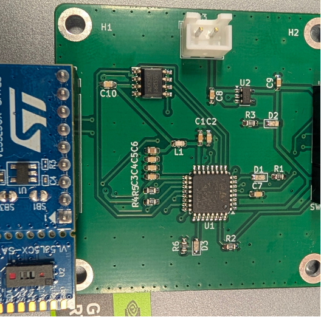
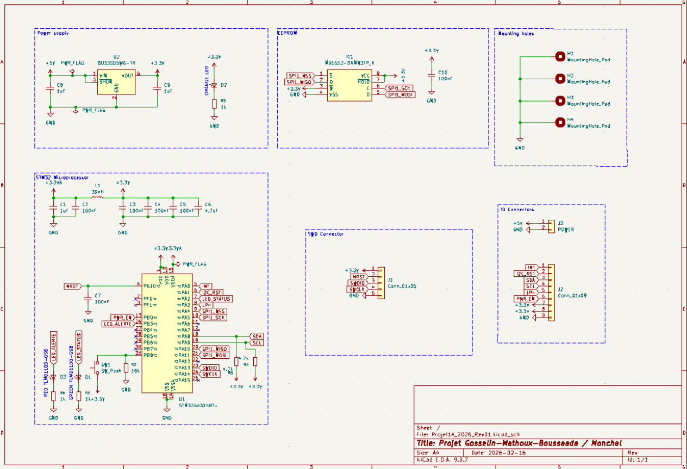

# Wall Locator — ToF Obstacle & Wall Detection Board

> A custom PCB that uses a Time-of-Flight sensor to detect obstacles and, thanks to the sensor's 3D matrix, tell a wall apart from any other object, lighting an LED when an obstacle is detected.

## Description

This was a first year Team project at ENSEA. The goal was to design a complete electronics board from scratch, covering the entire chain: schematic, PCB routing, hand soldering, coding the C project.

The board reads a VL53L5CX Time-of-Flight sensor over I²C and lights an LED when an obstacle is detected. Going further, it uses the sensor's 3D matrix to detect flat surfaces and distinguish a wall from another obstacle

**Possible applications:** household robots (e.g. robot vacuums), automotive parking sensors.

---

##  My Role

> In this project, I was responsible of the schematic and the C coding.

---

## Hardware

| Block | Component | Usage |
|-------|-----------|-------|
| Microcontroller | STM32G431 (LQFP32) | The board's brain |
| Sensor | VL53L5CX Time-of-Flight | I²C, range up to 4 m, multizone matrix |
| Memory | EEPROM| SDA / SCL shared with the sensor on the I²C bus |
| Power | Power LEDs + connectors | On-board supply indication |

- PCB: 2-layer board, 50 × 50 mm, designed and routed in KiCad
- Assembly: hand-soldered (SMD components, including the LQFP32 MCU)

### Schematic iterations

Starting from a reference STM32 schematic provided in a KiCad course, I adapted it to the needs of this project. The final schematic is organized into clear functional blocks:

- **Microcontroller**: STM32G431 with its decoupling and reset circuitry
- **Sensor**: a dedicated block for the VL53L5CX Time-of-Flight sensor, wired to the MCU over I²C
- **EEPROM**: an on-board memory block sharing the I²C bus (SDA / SCL) with the sensor
- **Power**: supply block with indicator LEDs and power connectors
- **Mounting**: mounting holes for fixing the board

## Software

Written in **C** on the STM32G431 (STM32CubeIDE project):

- Defined the full pin mapping (I²C, sensor control lines `LPn` / `PWREN` / `INT`, status LEDs)
- Integrated ST's VL53L5CX driver and read the sensor over I²C
- Lights an LED when an obstacle is present
- Exploits the sensor's multizone matrix to detect flat surfaces → distinguishes a wall from an arbitrary object

## Results

- Functional board detecting obstacles up to 4 m
- Successfully distinguishes a wall from other objects using the sensor's 3D matrix
- Full hardware chain delivered: schematic + routed PCB + soldered board + working firmware

